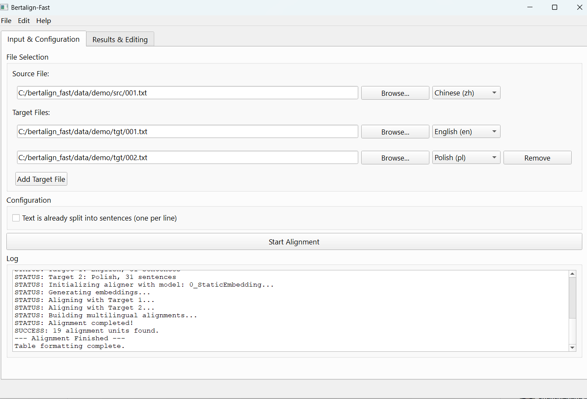
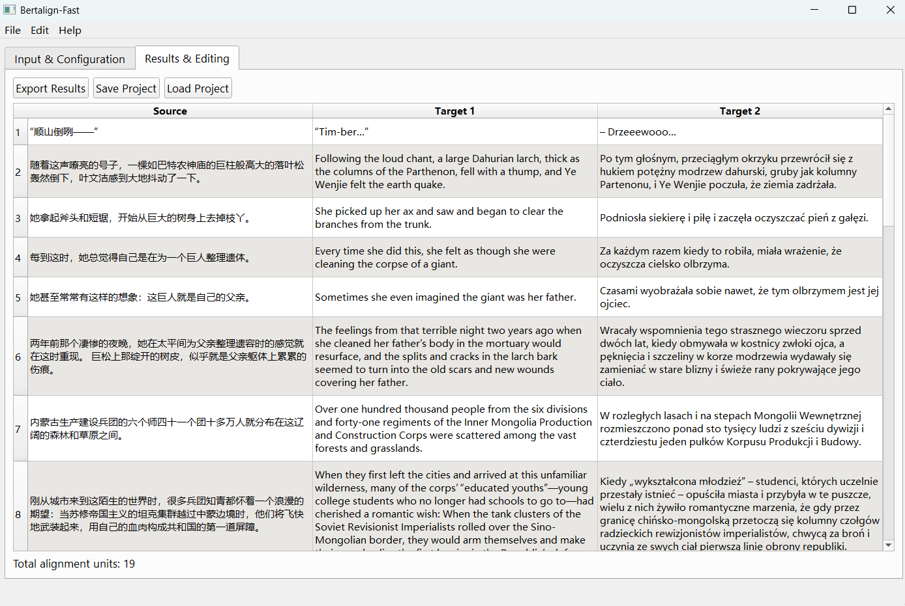

# Bertalign-Fast

An automatic mulitlingual sentence aligner optimized for CPU.

## Overview

Bertalign-Fast is a lightweight, CPU-optimized version of [Bertalign](https://github.com/bfsujason/bertalign) that uses [modern SWE](https://huggingface.co/sentence-transformers/static-similarity-mrl-multilingual-v1) (Static Word Embeddings) instead of CWE (Contextualized Word Embeddings).

### Key Features

- 🚀 **Fast on CPU** - No GPU required
- 💡 **Lightweight** - Use static word embeddings
- 🌍 **Multilingual** - Support 30+ languages
- 🎯 **Accurate** - Maintain high alignment quality
- 🖥️ **User-friendly GUI** - Visual interface for alignment tasks
- 🔄 **Multi-version alignment** - Align multiple language pairs or document versions

### When to Use Which?

- Use Bertalign when:
  - You have GPU available
  - Maximum accuracy is critical
  - Processing time is not a constraint
  - Working with complex literary or highly nuanced texts

- Use Bertalign-Fast when:
  - You need fast CPU inference
  - Processing large volumes of text
  - Running on resource-constrained systems
  - Working with non-literary texts (news, technical documents, etc.)

## Installation

```bash
git clone https://github.com/bfsujason/bertalign_fast.git

cd bertalign_fast

# Core only
pip install -r requirements.txt

# If you want the GUI
pip install pyqt5 igraph

# Download SWE model
python download_model.py

# Use mirror site if you cannot visit Hugging Face
python download_model.py --mirror hf-mirror.com
```

## Quick Start

```python
from bertalign_fast import BertalignFast

# Initialize aligner
aligner = BertalignFast()

# Load texts to be aligned
src_file = "data/demo/src/001.txt"
tgt_file = "data/demo/tgt/001.txt"
src_text = open(src_file, "rt", encoding="utf-8").read()
tgt_text = open(tgt_file, "rt", encoding="utf-8").read()

# Start aligning
aligner.align_sents(src_text, tgt_text)

# Print sentence indices and bead scores
print(aligner.alignment)

# Print aligned sentences
for src_sent, tgt_sent in aligner.bitext:
    print(f"{src_sent}\n{tgt_sent}\n")
```

## Evaluation

Run on Intel Core i7-11800H CPU @ 2.30GHz, 16G RAM 

### Test Data

| dataset  | genre      | language | # 1-1 alignment |
| :------: | :--------: | :------: | -----------:    |
| gov      | political  | zh-ja    | 1574 (87.4%)    |
| berg     | yearbook   | de-fr    | 678 (74.0%)     |
| mac      | literary   | zh-en    | 2628 (59.8%)    |

```bash
python aligner_eval.py --dataset gov

python aligner_eval.py --dataset berg

python aligner_eval.py --dataset mac
```

### Result

The running time includes both embedding and aligning.

| dataset  | precision  | recall   | F1    | time    |
| :------: | :--------: | :------: | :---: | -----:  |
| gov      | 0.986      | 0.988    | 0.987 | 13.20s  |
| berg     | 0.909      | 0.911    | 0.910 | 4.79s   |
| mac      | 0.870      | 0.892    | 0.881 | 19.49s  |

## GUI Usage

Bertalign-Fast includes a graphical interface for alignment tasks.

The GUI was prototyped and refined using Claude Sonnet 4.5 as a coding assistant.

### Lauch

```bash
python aligner_gui.py
```

### Features

- Automatic language detection with manual override
- Align one source against multiple targets simultaneously
- Interactive table editing: split, merge, delete, and add rows
- Undo/Redo support (Ctrl+Z / Ctrl+Y)
- Mark/Unmark rows with a distinct color for review
- Export to TMX, TSV, and JSON formats
- Project save/load

### Editing Actions

| Action     | How                                           |
| ---------- | ------------------------------------------    |
| Edit cell  | Double-click the cell                         |
| Mark rows  | Select rows → right-click → Mark/Unmark       |
| Split text | While editing → right-click → Split at cursor |
| Move text  | While editing → right-click → Move Up/Down    |
| Merge rows | Select rows → right-click → Merge             |

### Demo: Multi-Language and Multi-Version Alignment

The `data/demo` directory contains a Chinese source file and three target files, which can be used to demonstrate two workflows:

**Multi-language alignment**: Align a [Chinese source](data/demo/src/001.txt) against both an [English](data/demo/tgt/001.txt) and a [Polish](data/demo/tgt/002.txt) human translation (zh-en-pl), producing a trilingual parallel corpus in one pass.

**Multi-version alignment**: Align a [Chinese source](data/demo/src/001.txt) against a [human](data/demo/tgt/001.txt) and a [ChatGPT](data/demo/tgt/003.txt) English translation side by side, useful for comparing translation quality across different versions of the same text.

To try it: load the source file, click "Add Target File" to add multiple target files, then click "Start Alignment."




## Acknowledgments

- [Hugging Face Static Embedding Models](https://huggingface.co/blog/static-embeddings)
- [Vecalign](https://github.com/thompsonb/vecalign)
- [Bleualign](https://github.com/rsennrich/bleualign)
- [Adaptative Aligner](https://gricad-gitlab.univ-grenoble-alpes.fr/kraifo/ailign)

## Support

Questions, bug reports, and feature requests are welcome. Please open an [issue](https://github.com/bfsujason/bertalign_fast/issues) on GitHub.

Feedback on the following is especially appreciated:

- Language pairs: The evaluation only covers zh-ja, de-fr, and zh-en. If you test other pairs, we'd love to hear your results.

- Operating systems: The GUI has been tested on Windows. Reports from macOS and Linux users would be very helpful.
